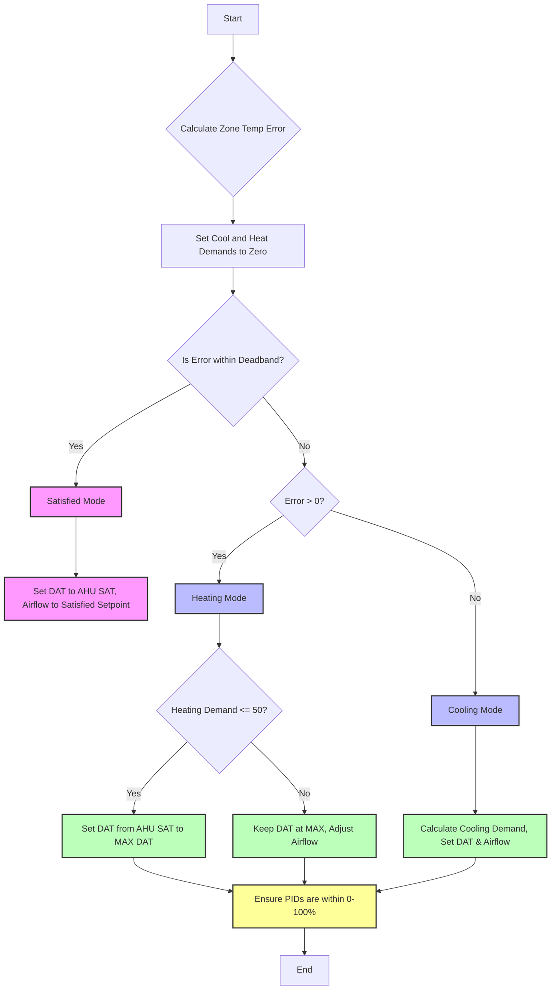

# wasm-hvac-controls
G36 concept ideas of WebAssembly in HVAC controls PLC logic

## Overview
This project simulates the firmware for controlling a HVAC (Heating, Ventilation, and Air Conditioning) VAV (Variable Air Volume) box. It's designed as a tool for developers, engineers, and enthusiasts to understand, develop, and test the control logic behind the operation of a VAV box in HVAC systems. The simulation covers temperature regulation through heating and cooling demands, air flow control, and PID (Proportional, Integral, Derivative) control strategies to maintain the desired setpoints.

## Features
* `Temperature Setpoint Control`: Simulate changes in the space temperature and adjust the VAV box settings to reach and maintain a specified temperature setpoint.
* `Heating and Cooling Demand Calculation`: Dynamically calculate the heating and cooling demands based on the difference between the current temperature and the setpoint.
* `Airflow Control`: Adjust the airflow based on the mode of operation (heating, cooling, or satisfied) to efficiently meet the temperature requirements.
* `PID Control for Heating and Cooling`: Utilize PID control strategies for precise control over heating and cooling processes, including adjustments for integral windup prevention.
* `State Machines for Sensor Reliability`: (TODO) Implement state machines to manage sensor data reliability, G36 fault detection rules, "requests" for VAV box heat/cool/air, integral windup prevention, and occupancy state for unoc zone temperature setpoints.

## G36 VAV Box Spec
The system's state—whether heating, cooling, or satisfied—is determined by the deviation of the zone temperature from the setpoint, also referred to as the zone temperature error. According to G36 guidelines, separate PID controllers are employed for heating and cooling. The outputs of these controllers dictate adjustments: In heating mode, both the discharge air temperature setpoint and the air flow setpoint may be reset based on the values of the heating PID output. In cooling mode, adjustments involve only the air flow setpoint reset, based on the cooling PID output.

## Wat files
Tested on Windows and checking for proper Wat file syntax on the [wat2wasm](https://webassembly.github.io/wabt/demo/wat2wasm/) website which can also convert files to `.wasm`. See py files `wat_file_sim_` for current tests!